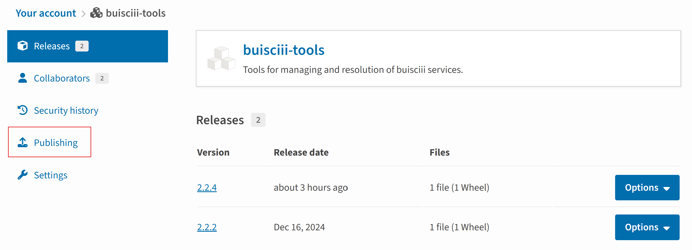
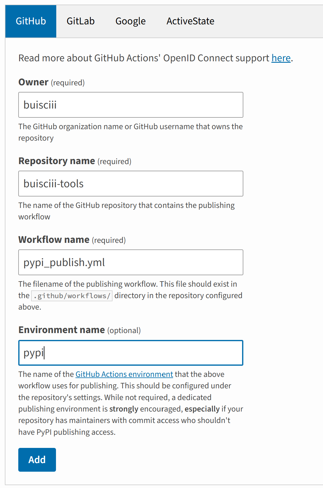

# Deploy to pip and bioconda

- [Deploy to pip and bioconda](#deploy-to-pip-and-bioconda)
  - [Deploy to pip](#deploy-to-pip)
    - [Introduction](#introduction)
    - [Creating the package files](#creating-the-package-files)
    - [Understand and create toml file](#understand-and-create-toml-file)
    - [Build and upload to pypi](#build-and-upload-to-pypi)
      - [Generating Distribution Archives](#generating-distribution-archives)
      - [Uploading the Distribution Archives](#uploading-the-distribution-archives)
    - [Use github actions to deploy](#use-github-actions-to-deploy)
    - [References](#references)
  - [Deploy to bioconda](#deploy-to-bioconda)
    - [Introduction](#introduction-1)
    - [Conda recipes](#conda-recipes)
    - [Contributing workflow](#contributing-workflow)
    - [Update a Conda Recipe with a New Version](#update-a-conda-recipe-with-a-new-version)
    - [References](#references-1)

## Deploy to pip

### Introduction

Python packaging is the process of organizing and distributing Python projects so they can be easily shared, installed, and reused. It involves creating packages that bundle code and metadata, making them accessible to others. PyPI (Python Package Index) is the official repository for Python packages, serving as a central platform where developers can publish their libraries and tools. Users can then install these packages using tools like pip, streamlining the management of dependencies and fostering a vibrant ecosystem for Python developers. ([know more](https://packaging.python.org/en/latest/overview/)).

### Creating the package files

To configure a Python package like for example buisciii-tools, you need to follow a standard project structure and include specific files for metadata and functionality. Below is an example of a typical file structure:

```bash
buisciii-tools/
├── buisciii_tools/       # Main package directory
│   ├── __init__.py       # Marks the directory as a Python package
│   ├── __main__.py       # Package entry point and gui
│   ├── utils.py          # Example module containing functions
│   └── data_processing.py  # Another module
├── tests/                # Directory for unit tests
│   ├── __init__.py
│   └── test_utils.py
├── pyproject.toml        # Primary configuration file
├── LICENSE               # Licensing information
├── README.md             # Project description
└── requirements.txt      # List of dependencies (optional)
```

With this package structure `__init__.py` will indicate the folder as a python package and pyproject.toml file will point to the function in `__main__.py` that serves as entry point for the package.

### Understand and create toml file

The pyproject.toml file is a modern configuration file for Python projects. It defines build requirements, project metadata, and additional settings in a structured way. It’s essential for packaging, building, and distributing Python software.

Step 1: Create the Basic Structure

Start with the mandatory [build-system] table:

```bash
[build-system]
requires = ["setuptools", "setuptools-scm"]  # Build dependencies
build-backend = "setuptools.build_meta"      # Specifies the build system
requires: Lists tools needed to build your project (e.g., setuptools).
build-backend: Indicates the backend used for building (usually setuptools.build_meta).
```

Step 2: Add Project Metadata

The `[project]` table contains details about your project:

```bash
[project]
name = "buisciii-tools"                      # Project name
version = "1.0.0"                            # Project version
dynamic = ["dependencies"]                   # Indicates dynamically set fields
requires-python = ">=3.8"                    # Python version compatibility

authors = [
    {name = "Sara Monzon", email = "smonzon@isciii.es"},
    {name = "Luis Chapado", email = "lchapado@externos.isciii.es"},
]
maintainers = [
    {name = "Sara Monzon", email = "smonzon@isciii.es"}
]
description = "A set of tools for data processing and bioinformatics analysis."
readme = "README.md"                          # Path to README file
license = {file = "LICENSE"}                 # License file
keywords = [
  "bioinformatics",
  "data processing",
  "Python tools"
]
```

authors and maintainers: Lists individuals associated with the project.
readme: Points to a README file for documentation.
license: Specifies the license file.
keywords: Helps categorize your project on PyPI.

Step 3: Add URLs

Include links to your project’s homepage and issue tracker:

```bash
[project.urls]
Homepage = "https://github.com/bu-isciii/buisciii-tools"
Issues = "https://github.com/bu-isciii/buisciii-tools/issues"
```

Step 4: Define Dependencies

Use `[tool.setuptools.dynamic]` to define dependencies dynamically via a requirements.txt file:

```bash
[tool.setuptools.dynamic]
dependencies = {file = ["requirements.txt"]}
```

This points to a file (requirements.txt) listing your project's dependencies.

Step 5: Add Entry Points
Define CLI entry points for your package:

```bash
[project.scripts]
buisciii-tools = "buisciii_tools.__main__:run_buisciii_tools"
```

This means running buisciii-tools on the command line will execute the run_buisciii_tools function in the `buisciii_tools.__main__` module.

Step 6: Configure Package Discovery

Control which directories or files are included/excluded in your package:

```bash
[tool.setuptools.packages.find]
exclude = ["tests", "docs", "examples"]
```

This excludes specific directories (e.g., tests, docs, examples) from the package.

### Build and upload to pypi

#### Generating Distribution Archives

To prepare your package for distribution, you need to create distribution archives. These are the files that get uploaded to the Python Package Index (PyPI) and can be installed using pip.

First, ensure you have the latest version of PyPA’s build tool installed:

On Unix/macOS:

```bash
python3 -m pip install --upgrade build
```

**Important:** The package will be built using the version number specified in the pyproject.toml file. It is strongly recommended to create a development or edge version for this first-time upload to PyPI (e.g., 0.0.1edge).

This ensures that the production version tag (e.g., v0.0.1) remains available for use once the software release is finalized and published on GitHub.
Next, navigate to the directory containing your pyproject.toml file and run the following command:

On Unix/macOS:

```bash
python3 -m build
```

This command will produce a lot of output and generate two files in the dist directory:

```bash
dist/
├── example_package_YOUR_USERNAME_HERE-0.0.1edge-py3-none-any.whl
└── example_package_YOUR_USERNAME_HERE-0.0.1edge.tar.gz
```

#### Uploading the Distribution Archives

Now it’s time to upload your package to the Python Package Index (PyPI).

- Step 1: Register on pypi
We already have a bu-isciii account in pypi.

User: buisciii
password: "same as always"

You probably need two factor authentication. Talk to Sara about this.

Step 2: Generate a PyPI API Token
To securely upload your package, generate an API token:

Go to Pypi API Tokens.
Create a new token with the scope set to “Entire account.”
Copy and save the token — **you won’t be able to view it again later.**

Step 3: Install Twine
Twine is a utility for securely uploading Python packages. Install it using:

On Unix/macOS:

```bash
python3 -m pip install --upgrade twine
```

Step 4: Upload the Package
Use Twine to upload all files in the dist directory:

```bash
python3 -m twine upload dist/*
```

You’ll be prompted for your API token. Enter the token, including the pypi- prefix. (The input will be hidden, so make sure to paste it correctly.)

Step 5: Verify the Upload
Once uploaded, you should see output similar to the following:

```bash
Uploading distributions to https://pypi.org/legacy/
Enter your API token:
Uploading example_package_YOUR_USERNAME_HERE-0.0.1-py3-none-any.whl
100% ━━━━━━━━━━━━━━━━━━━━━━━━━━━━━━━━━━━━━━━━ 8.2/8.2 kB • 00:01 • ?
Uploading example_package_YOUR_USERNAME_HERE-0.0.1.tar.gz
100% ━━━━━━━━━━━━━━━━━━━━━━━━━━━━━━━━━━━━━━━━ 6.8/6.8 kB • 00:00 • ?
```

Your package will now be available on Pypi.

### Use github actions to deploy

You need to follow the instructions above to create the project on PyPI for the first time. After that, a GitHub Action workflow can be used to automatically upload a new version to PyPI whenever a new version is released on GitHub.

Step 1: Configure the github repository as a trusty publisher on pypi.


Go to `Publishing` and `Add a new publisher`:



Fill the form accordingly the workflow and environment you are going to create in the next step.

Step 2: Create a workflow in `.github/workflows` named `pypi_publish.yml` with the following content. You'll only need to change the url to pypi accordingly to the package you are configuring.

```bash
name: Publish package python distribution to Pypi

on:
  release:
    types: [published]
  workflow_dispatch:

jobs:
    build:
      name: Build distribution
      runs-on: ubuntu-latest
      steps:
      - uses: actions/checkout@v4
      - name: Set up Python
        uses: actions/setup-python@v5
        with:
          python-version: 3.12.7
      - name: Install pypi/build
        run: >-
          python3 -m
          pip install
          build
          --user
      - name: Build a binary wheel and a source tarball
        run: python3 -m build
      - name: Store the distribution packages
        uses: actions/upload-artifact@v4
        with:
          name: python-package-distributions
          path: dist/

    publish-to-pypi:
      name: Publish dist to PyPI
      needs:
      - build
      runs-on: ubuntu-latest
      environment:
        name: pypi
        url: https://pypi.org/p/buisciii-tools
      permissions:
        id-token: write
      steps:
      - name: Download all the dists
        uses: actions/download-artifact@v4
        with:
          name: python-package-distributions
          path: dist/
      - name: Publish to PyPI
        uses: pypa/gh-action-pypi-publish@release/v1
```

Commit and create a pull request to the develop branch of the package repository, then wait for the release to be published.

### References

- [Python packaging user guide](https://packaging.python.org/en/latest/tutorials/packaging-projects/)
- [Github actions for upload to pypi](https://packaging.python.org/en/latest/guides/publishing-package-distribution-releases-using-github-actions-ci-cd-workflows/)

## Deploy to bioconda

### Introduction

Conda is a popular package and environment management system that simplifies the installation, management, and sharing of software and dependencies across platforms. It’s widely used in data science, machine learning, and bioinformatics for managing complex software environments. Bioconda, a community-driven project, extends Conda by providing a vast collection of pre-built bioinformatics software packages. It simplifies the distribution and usage of tools in computational biology, ensuring reproducibility and easy installation for researchers and developers.

### Conda recipes

The meta.yaml file defines the metadata and build instructions for a Conda package. Its key sections include:

package: Specifies the package name and version.

```yaml
package:
  name: example-package
  version: "1.0.0"
```

source: Defines the source of the package, such as a URL or Git repository, along with its checksum for integrity.

```yaml
source:
  url: https://example.com/example-package-1.0.0.tar.gz
  sha256: abcdef1234567890
```

build: Contains build instructions, including build number and optional script names.

```yaml
build:
  number: 0
  script: build.sh
```

requirements: Lists runtime and build-time dependencies.

```yaml
requirements:
  build:
    - python
    - setuptools
  run:
    - python >=3.6
    - numpy
```

test: Specifies commands or files used to test the package after building.

```yaml
test:
  commands:
    - python -c "import example_package"
  requires:
    - pytest
```

about: Includes descriptive information about the package, such as summary, license, and authors.

```yaml
about:
  home: https://github.com/example/example-package
  license: MIT
  summary: "An example package for demonstration."
```

extra (optional): Additional metadata, often used to specify maintainers.

```yaml
extra:
  maintainers:
    - your-username
```

This structure ensures that the package is well-defined, easy to build, and ready for deployment in Conda and Bioconda ecosystems.

### Contributing workflow

**Step 1:** Fork the Bioconda Recipes Repository

Navigate to the Bioconda Recipes repository.

Click Fork to create your copy.

**Step 2:** Clone and Create a Branch
Clone your fork and create a new branch for your recipe:

```bash
git clone https://github.com/YOUR_USERNAME/bioconda-recipes.git
cd bioconda-recipes
git checkout -b add-my-package #change my package for your package name
```

**Step 3:** Create the Conda Recipe
Use Grayskull to generate the recipe skeleton from PyPI:

```bash
grayskull pypi PACKAGE_NAME
```

Example:

```bash
grayskull pypi taranys
```

or if you don't have the package yet in pypi you can use the github repo url:

```bash
grayskull pypi https://github.com/BU-ISCIII/taranys
```

Move the generated recipe to the appropriate folder in bioconda-recipes:

```bash
mv PACKAGE_NAME recipes/PACKAGE_NAME/
```

Manually edit the meta.yaml file if needed:

- Update dependencies. **IMPORTANT** The skeleton will only be populated with dependencies in the `pyproject.toml` file, you will need to add dependencies set in both `requirements.txt` or `environment.yml` if any inside the `run:` section.
- Add maintainers.
- Check licensing information. Reviwers ask for GPL-3.0-or-later (adding the -or-later that is not added with the skeleton)
- Add the run_export parameters.

Example:

```yaml



package:
  name: {{ name|lower }}
  version: {{ version }}

source:
  url: https://github.com/BU-ISCIII/taranys/archive/{{ version }}.tar.gz
  sha256: 89824baa50f8b5ecf2e20b15ee841391401b250a29db720bff5c025c806042c1

build:
  entry_points:
    - taranys = taranys.__main__:run_taranys
  noarch: python
  script: {{ PYTHON }} -m pip install . -vv --no-deps --no-build-isolation
  number: 0
  run_exports:
    - {{ pin_subpackage(name, max_pin="x") }}

requirements:
  host:
    - python >=3.10
    - setuptools
    - setuptools-scm
    - pip
  run:
    - python >=3.10
    - poetry >=1.7.1
    - prokka >=1.14
    - blast >=2.9
    - mash >=2
    - prodigal >=2.6.3
    - mafft >=7.505
    - igraph >=0.9.8
    - rich >=13.4.1
    - click >=8.1.3
    - leidenalg >=0.9.1
    - questionary >=1.10.0
    - bio >=1.6.0
    - scikit-learn >=1.2.0
    - plotly >=5.11.0
    - python-kaleido >=0.2.1
    - six >=1.16.0

test:
  imports:
    - taranys
  commands:
    - taranys --help
  requires:
    - pip

about:
  summary: cg/wgMLST allele calling software, schema evaluation and allele distance estimation for outbreak reserch.
  license: GPL-3.0-or-later
  license_file: LICENSE
  home: https://github.com/BU-ISCIII/taranys

extra:
  recipe-maintainers:
    - saramonzon
```

**Step 4:** Test and Lint the Recipe Locally
Set up Bioconda build tools:

```bash
micromamba install -c conda-forge bioconda-utils conda-build
```

Lint the recipe:

```bash
bioconda-utils lint recipes config.yml --packages PACKAGE_NAME
```

Test the recipe:

```bash
bioconda-utils build recipes config.yml --packages PACKAGE_NAME
```

Fix any errors and repeat the process until the recipe is built and test successfully.

**Step 5:** Create a Pull Request

Push your branch to your fork:

```bash
git add .
git commit -m "Add new recipe for PACKAGE_NAME"
git push origin add-my-package
```

Create a Pull Request on the main bioconda-recipes repository.

Wait for the CI tests to complete and use the Bioconda bot commands to request a review and merge:

Request a review commenting this message in the PR:

```bash
@bioconda-bot please add label
```

Merge the PR after approval:

```bash
@bioconda-bot please merge
```

### Update a Conda Recipe with a New Version

To bump a new version:

1. Update the meta.yaml File

Modify the version field to the new version.
Update the sha256 hash for the new source file:

```bash
wget NEW_SOURCE_URL -O [new_source.tar.gz](https://github.com/BU-ISCIII/taranys/archive/refs/tags/3.0.1.tar.gz)
sha256sum 3.0.1.tar.gz
```

Replace the old hash with the new one in meta.yaml.

2. Follow the Contribution Workflow

Create a branch, update the recipe, and test locally as described above.
Push the branch and open a PR for review and merge.

### References

- [Contributing to bioconda](https://bioconda.github.io/contributor/index.html)
- [Conda packages recipes](https://bioconda.github.io/tutorials/gcb2020.html#conda-package-recipes)
- [Don't fear skeletons](https://bioconda.github.io/tutorials/gcb2020.html#don-t-fear-skeletons)
