<<<<<<< HEAD
# **NEW SERVICE**
=======
## New service
In order to take a service before starting the data analysis, you should firstly have credential for [iSkyLims](https://iskylims.isciii.es/) as well as for the HPC. Use your personal credentials to log in iSkyLims (version 3.0.0) and then click on **Bioinformatics unit: analysis requests**.
>>>>>>> be74ec7 (Update on How-to-manage-services-in-iSkyLims)

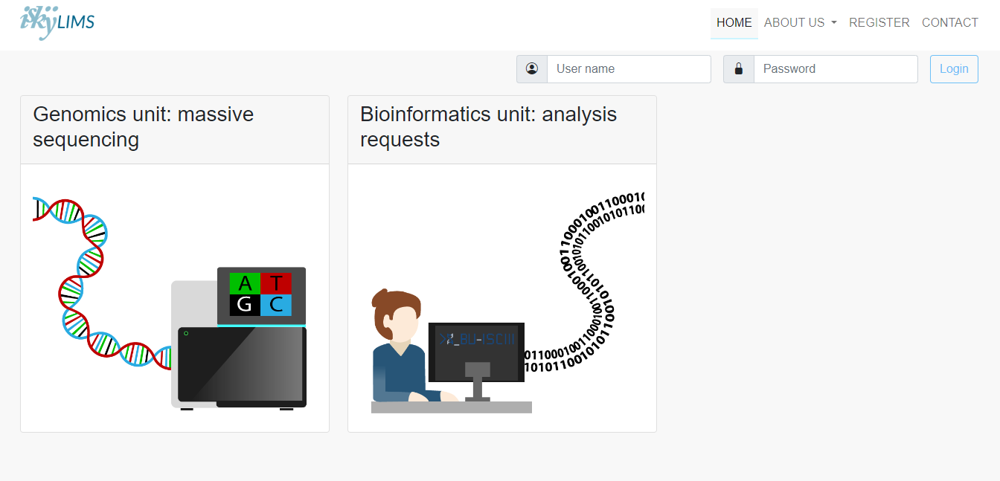

On section *Recorded services*, all the new services, sorted by the *Service Number* and the researcher who is requesting it, will be displayed.

<<<<<<< HEAD
CLick on **Bioinformatics unit: analysis requests** and the page will display under *Recorded services* the new services sorted by the Service Number and the researcher who requested the service.

To get more details of the service request, go to the tab ***MANAGE SERVICES*** and select ***PENDING SERVICES***. A new window with the tabs ***Services lists*** and ***My services*** will show up. Under ***Services lists***, click on tab ***Recorded*** and have a look of the service information by clicking on the service ID for that request.
=======
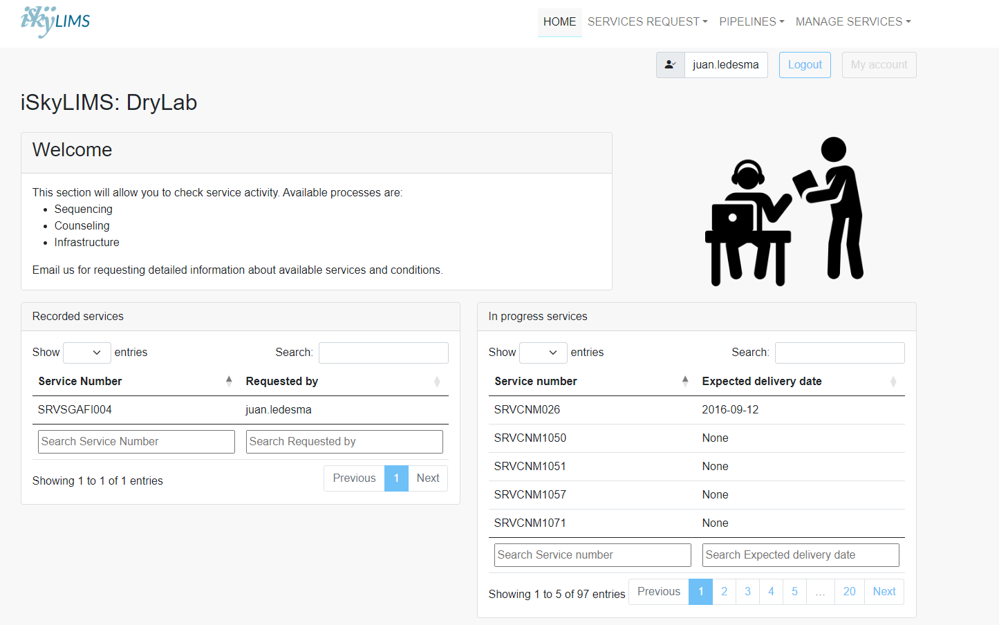

To get more details of the service request, go to the tab **MANAGE SERVICES** and select ***PENDING SERVICES***. A new window, called **Ongoing services** with the tabs ***Services lists*** and ***My services*** will show up. Under ***Services lists***, click on tab ***Recorded*** and have a look of request description by clicking on the **Service ID**. 

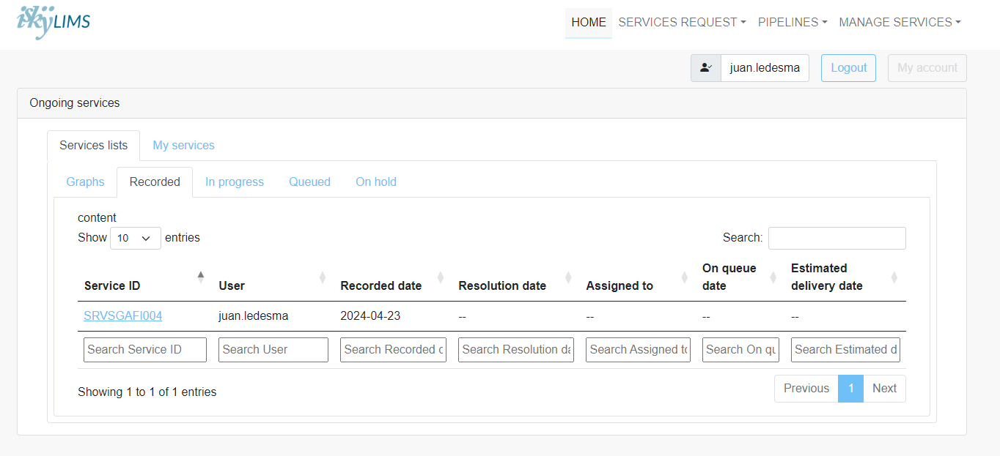 

A new window (**Service information**) displays the following information:
- general information about the request such as the *Username* of the researcher submitting the request, *Service state*, the date the request was created or even files uploaded needed for the data analysis (i.e. references sequences to be use for mapping). 
- ***Requested Services***, containing the services the user has selected for the data analysis.
- ***New Resolutio*n**, with the Service ID following the convention used at the BU-ISCIII.
- ***Services Notes***, containing comment made by the user that may be useful for the data analysis. 
- ***On going resolutions***, by default, it is empty but it will include all the resolutions created for the data analysis. 
- ***Resoultions***, as the option above it is empty but it will contains the new resolutions.
- ***Samples***, the samples the user selected fo the data analysis. 
 
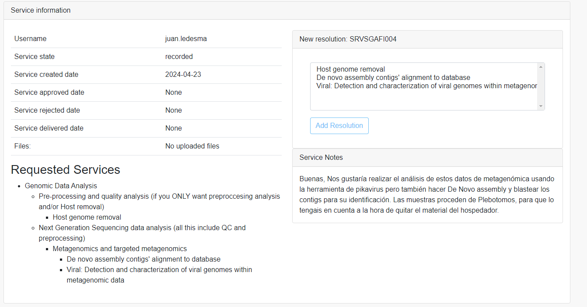 

Before taking the service and creating a new resolution for the current service (by clicking om **Add Reolution**), it is a a good practice to check the notes the researcher incldued in the request and double-check this matches the selection of services they made on the iSkyLims interface.
>>>>>>> be74ec7 (Update on How-to-manage-services-in-iSkyLims)

In the service displayed in the images, the user selected `Host genome removal`, `De novo assembly contigs' alignment to database` and `Viral: Detection and characterization of viral genomes within metagenomic data` as ***Requested Services***. However the first selection seems to be incorrect according to the descriptions from ***Services Notes***. An email should be sent to the user to confirm the selection before start the service, if needed. In addition, the user requested to perform *de novo* assembly in th notes but they did not selected `Viral: Genomic reconstruction, variant calling and de novo assembly`. 

<<<<<<< HEAD
The new window shows the Services the researcher selected in iSkyLims on the leftr side and on the right side the summary of the services under (***New resolution: \*\*\****) and comments that the user included at the time of the request (***Services Notes***)

#### **SERVICE REQUEST MOFIDIFICATION**

* *SERVICE CHANGES*.

It is a good practise to check the notes the researcher incldued in the request and double check this matches with the selection they made. For example, in the current example the user selected in iSkyLims the services "Host genome removal", "De novo assembly contigs' alignment to database" and "Viral: Detection and characterization of viral genomes within metagenomic data" but "Host genome removal" is incorrect according to their notes. At the time, they did not select the option "Viral: Genomic reconstruction, variant calling and de novo assembly", useed to carry out *De Novo* assembly. All this things can be modified using the iSKylims bioinfoadm credentials and it is strongly recommeded to do it before creating the service resolution.

Once you have logged as bioinfoadm in iSkyLims (ask for the password if you do not know it), got to <https://iskylims.isciii.es/admin/> and scrowl down to the section **DRYLAB** and click on ***Services***

=======
It is strongly recommended to modify any detail in the service request before creating any new resolution. In order to do that, log in iSkyLims using `bioinfoadm` credentials, then go to https://iskylims.isciii.es/admin/ and scrowl down to the section **DRYLAB** and click on ***Services***

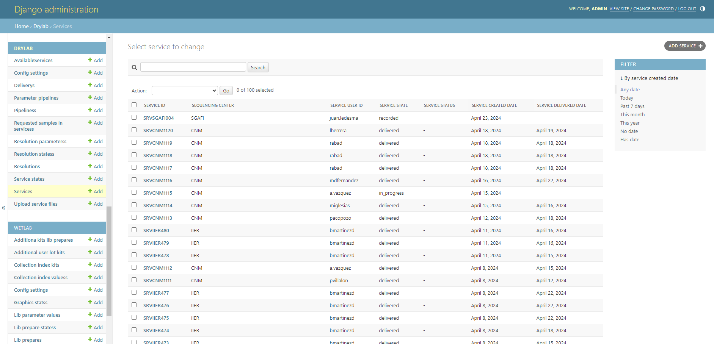

Click on the the Service ID to be modified and select the correct options among the list of ***AvailableService***. You may need to select a choice in ***Service Status***.

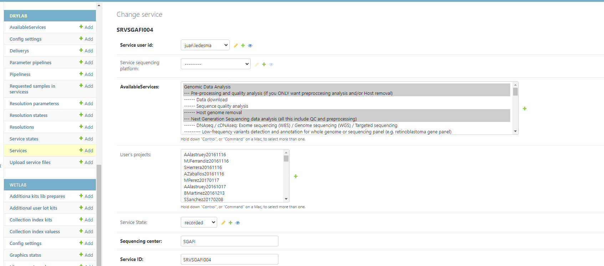

You may want to double-check those new changes in the service in the iSkyLims interface. The same proceeding could be used to change other details in a service (i.e. modification of services for a second resolution of the same service). 

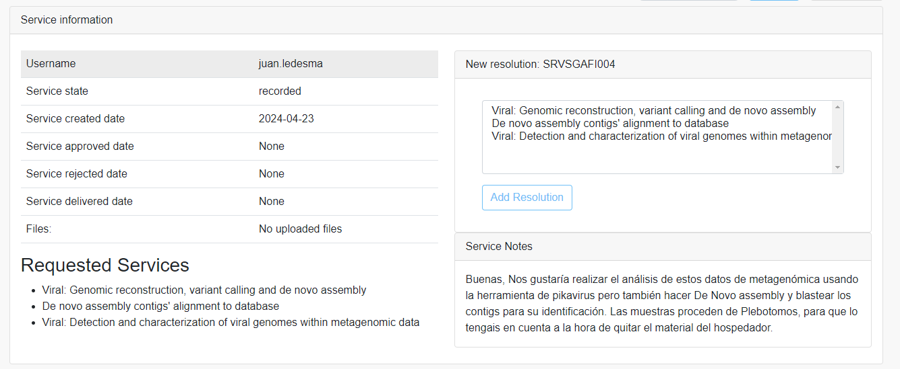

Sometimes, samples may need to be addded/removed from the list of data to be processed.  This modification must be made on ***Samples*** tab. 

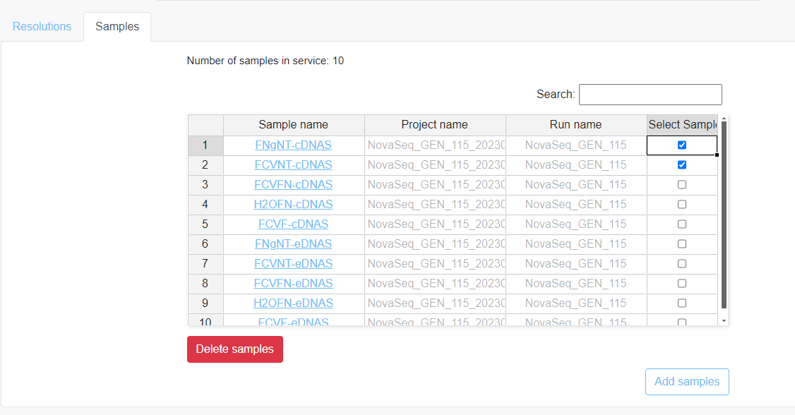
>>>>>>> be74ec7 (Update on How-to-manage-services-in-iSkyLims)

In order to add new samples, press buttom **Add Samples** and a new window wil be displayed. The field ``Search``can be used to find the samples to be added (i.e. using the Run ID), select them and then press **Submit**. A new window will show the ID of the samples included in the services. 

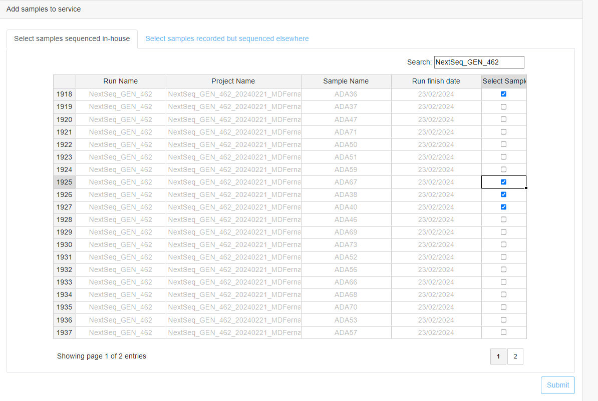

In case of removing samples from the list, choose the Ids of interest in *Select Samples* and then press **Delete Samples**. An alternative to select several samples in a row, you can clik on one and then select the next samples by dragging the black square of the selection rectangule.     

<<<<<<< HEAD
The same proceeding could be used for changes in the resolution (once the services has been created) or any other kind of things.

* *ADDING/REMOVING NEW SAMPLES*

There would be times that some samples have not been included or the user added the wrong ones. For this porpuse the request can be modified on the *Samples* tab (on the bottom of the main *Service information* window).

* *adding new samples*, when you press buttom *Add Samples* a new window is open and you can use the field *Search* to try to find the samples to add to the list (for instance, using the Run ID and then selection the sample(s) of interest, and then press *Submit*. A new window will show up with the ID of the samples included in the services. Click on *Return to service* to go back to the main *Service informaction* window.  

* *removing samples*, in the column *Select Samples*, you can tick on the sample you want to remove from the list or if you want to select several samples, tick one and then select the next samples by dragging the black square on the rectangule. Then press *Delect samples* a new window will show the samples removed from the list.

#### **CREATING A NEW RESOLUTION**

By default a new service does not have a resolution until this one is created and the field allocated fo it remains empty in the main *Service information* window.

In order to create a new resolution for a service we need to click **Add Resolution** and a new window will be displayed containing the following fields:
* *Estimated resolution date*, enter the turnaround time (TAT) expected for the results to be available for the user.
* *Service acronym*, depending of the service that we are working with the acronym GENOME, VIRAL-DISCOVERY, ASSEMBLY.... (TODO)

* *Assigned user*, the bioinformatician responsible for the analysis of this service (aka yourself).
* *Resolution description*, any information you consider is worth adding to the resolution, tracking-wise.
=======
Once the details of the service request have been hecked (and corrected, if needed), create a *new resolution* for that service by clicking **Add Resolution**. A new window will be display the following fields:

- *Estimated resolution date*, enter the turnaround time (TAT) expected for the results to be available for the user.
- *Service acronym*, Some of the most frequently acronyms used at the BU-ISCII are GENOME (followed by the name of the virus) or SARSCOV2 for reference mapping for viruses, VIRAL-DISCOVERY for metagenomics analysis, ASSEMBLY for bateria. In order to select the proper one, check the service request as well as the notes in the *Service Information*. Once the acronym has been selected for the service, we need to assign a number for the service. For this, we need to go to `/data/bi/services_and_colaborations/CENTRO/AREA/` and search for the last service with the same acronym. For instance, if we have received a service from a Virology lab at the National Center of Microbiology consisting in analysing metagenomics data using Pikavirus, we should go to `/data/bi/services_and_colaborations/CNM/virology/` and search for all the services containing **VIRAL-DISCOVERY** in their name by using `ls | grep "VIRAL-DISCOVERY"`. The screen will display all the services with that acronym followed by a number. Find the one with the last service and use the corresponding next number for the new service (i.e **VIRAL-DISCOVERY666**). This will be the one to be added in this field.     
- *Assigned user*, the bioinformatician responsible for the analysis of this service (aka yourself).
- *Resolution description*, any information you consider is worth adding to the resolution.   
>>>>>>> be74ec7 (Update on How-to-manage-services-in-iSkyLims)

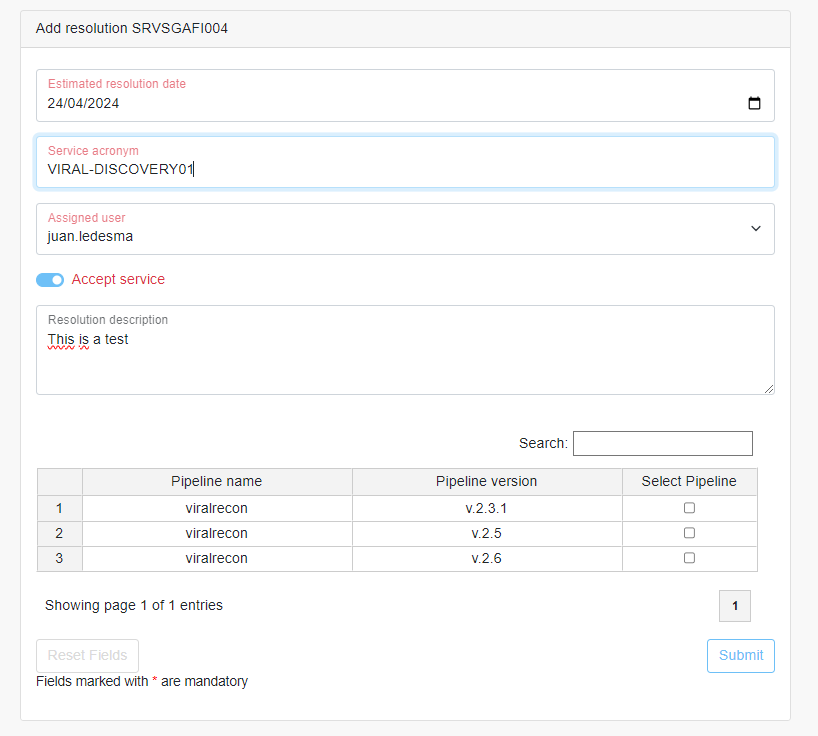

<<<<<<< HEAD
Once we are sure the service request matches what the reseracher is expecting, we can create a new resolution by clicking **Add Resolution**
=======
Once all the fileds have been filled in press **Submit**. The main *Service Information* window will be updated with the Acronym Name (following the convention`SRVRequesting-Area_Date_Service-AcronymXX_researcher_X`), the service state, the *On going resolutions* and *Resolutions*. Make a note of the *Resolution name* (i.e SRVAREAXXX.X) as it is needed for next steps in the service. 

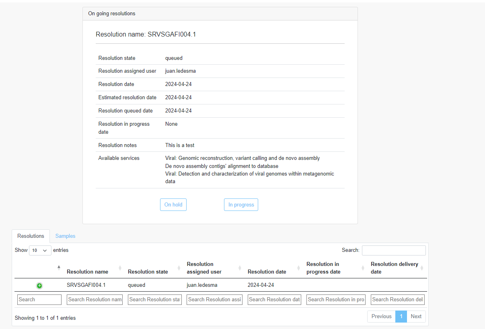

You may want to use **On hold** and **In process** depending on the service needs.

There may be times where the user wants to either re-analyse or use different tools on the same data, so that they will request (usually by email) new analysis for the same service. A *new resolution* can be created from the *Service information* window by clicking **Add Resolution**. Modify the service options if needed and proceeed in the same way as explained before.  

Check that new resolution (i.e. `SRVAREAXXX.2`) has been created succesfully on **Ongoing services**, and **My services**. Alternativelly you can click on the service ID and have a look of the details of resolutions available for the same service.

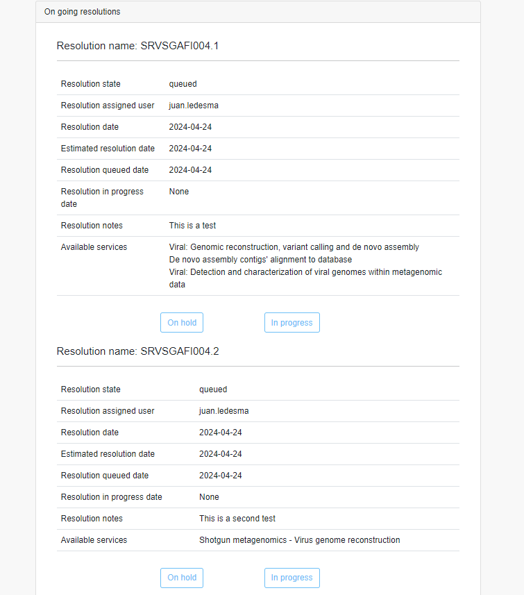

>>>>>>> be74ec7 (Update on How-to-manage-services-in-iSkyLims)
