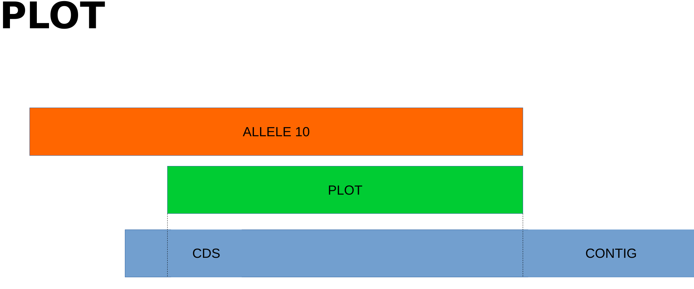
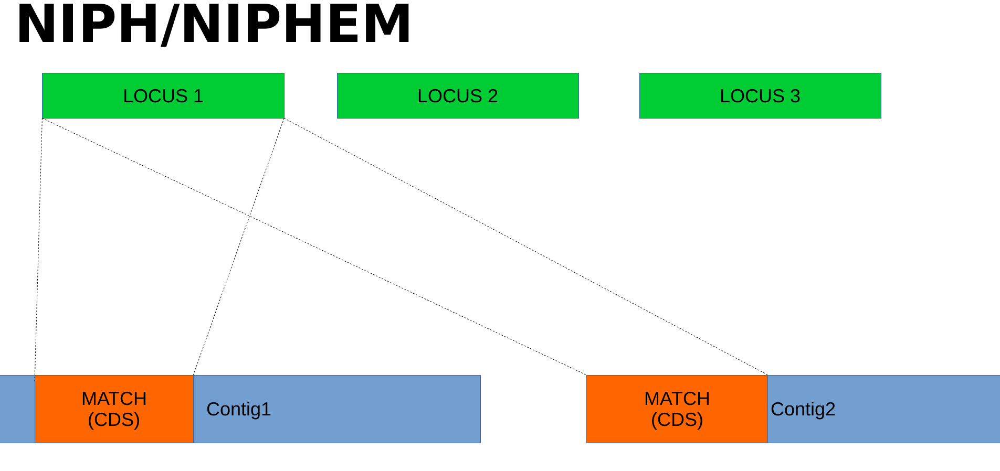
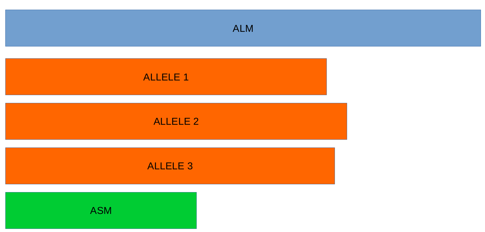

# How to perform a cgMLST/wgMLST service

## Introduction

This is a brief tutorial on how to perform a cgMLST/wgMLST service as a member of the ISCIII's Bioinformatics Unit! cgMLST/wgMLST is a associated with _Bacteria: Core genome or whole genome Multi-Locus Sequence Typing analysis (cg/wgMLST)_ service from service catalog.

MLST stands for MultiLocus Sequence Typing. For each hosekeeping gene, the different sequences present within a bacteria species are assigned as distinct alleles and, for each isolate, the alleles at each of the loci define the allelic profile or Sequence Type (ST). Do not confuse with SeroType, they are not the same. Each bacterial species has their own MLST schema. A Schema is a pre-defined set of loci that is used in MLST analyses. Traditional MLST schemas relied in 7 loci that were internal fragments of housekeeping genes. In genomic analyses, schemas can be:

- cgMLST (core-genome MLST): Set of loci that are present in the majority of strains for core genome (cg) MLST schemas, typically a threshold of presence in 95% of the strains is used in Schema Creation.
- wgMLST (whole-genome MLST): Set of loci that are present in at least one of the analyzed strains in the Schema Creation for whole genome MLST schemas.
- pgMLST (pan-genome MLST): Set of loci that are present in at least one of the analyzed strains in the Schema Creation for pan genome MLST schemas.
- agMLST (accesoty-genome MLST): Set of loci that are present in less than 95% of the strains for accessory genome MLST schemas.

Let's get started with the service. When performing a cgMLST/wgMLST service, remember that this service des not have a specific associated acronym. Usually, cgMLST/wgMLST service is part of assembly service (see the [assembly documentation](./Assembly-service.md)), because it need the assemblies to be performed. Some examples of service containg cgMLST/wgMLST are:

- WGSSPNEUMONIAE
- CORYNETUBERC
- SPYOGENES

## First steps

First of all, follow the [first steps to create a service](/link/to/tools/and/iskylims/TODO). Once the `new-service` is finished, you'll have a new folder with 6 folders: `ANALYSIS`, `DOC`, `RAW`, `REFERENCES`, `RESULTS` and `TMP` (as explained [here](https://github.com/BU-ISCIII/BU-ISCIII/wiki/bioinformatics#33-services_and_collaborations)). We should check the following folders before going any further:

- `RAW`: Check that the number of files contained within the RAW folder is equal to the number of samples specified in [iskyLIMS](https://iskylims.isciii.es/) x 2, in the case that they are paired-end reads.

If everything is OK, we can get into the `ANALYSIS` folder and we'll find the following items inside:

- `lablog_chewbbaca`: an executable file that creates the 00-reads folder, moves inside, creates symbolic links to the reads renaming them and renames the `ANALYSIS01_CHEWBBACA` folder to `DATE_ANALYSIS03_CHEWBBACA`
- `samples_id.txt`: a `.txt` file containing all the sample names, one per line, so there will be as many lines as samples associated with our service.
- `ANALYSIS01_CHEWBBACA`: Folder with the main chMLST/wgMLST analysis files.

First of all, let's **check in the `lablog_chewbbaca` if the renaming of the `ANALYSIS01_CHEWBBACA` is correct**:

- If cgMLST/wgMLST analysis is the only analysis in the service, the folder will be `DATE_ANALYSIS01_CHEWBBACA`
- If cgMLST/wgMLST analysis is part of other services, you will have to sum as many numbers as other analysis you have prior to MAG. Usually it is `DATE_ANALYSIS03_CHEWBBACA`

Now we can execute the lablog:

```bash
bash lablog_chewbbaca
```

> [!WARNING]
> If cgMLST/wgMLST is not the only analysis in your service, don't forget to run the other `lablogs` before the next steps.

After executing this file, if everything is OK, we can now proceed with the next BU-ISCIII tool: `scratch` as explained [here](/link/to/tools/and/iskylims/TODO)

Once this function is finished, we should go into the `scratch_tmp` folder and the corresponding `REFERENCE` folder and think about the reference schema for the analysis, which may vary depending on the request made by the user.

## Schemas

We have different ways to obtain the schema, creating it or downloading it. **It is better to download the schema from the DDBB rather than creating one**.

### Download

There are different websites to download the schemas:

- [Ridom schemas](https://www.cgmlst.org/ncs/): Used by SeqSphere
  - cgMLST: Select the bacteria > Show Targets > Download alleles as FASTA
- [chewbbaca](https://chewbbaca.online/stats):
  - wgMLST: Find the bacteria you want and select `SCHEMA DETAILS` > Go to Compressed schema and select `DOWNLOAD`
    - :warning: This ones do not need to perform `PrepExternalSchema` from chewbbaca
- [pubMLST](https://pubmlst.org/). Example for streptoccocus pnemoniae:
  - ST 7 genes: pubMLST > Organisms > Streptoccocus pneumoniae > Typing > Donloads (right) > Allele Sequences > Typing > MLST (Download the 7 one by one), then merge in single .fasta file.
  - ST profile definitions: pubMLST > Organisms > Streptoccocus pneumoniae > Typing > Donloads (right) > MLST/Allelic profiles > MLST (download button 2nd column) > CTRL + A > Copy paste to file
  - cgMLST: Use the [download_bigsdb_api](https://github.com/BU-ISCIII/download_bigsdb_api) this way:
    - In the service's `REFERENCE` folder where you want to download the files, run: `/data/bi/pipelines/download_bigsdb_api/get_files_from_rest_api.py --output_dir './<out_schema_dir>' interactive -db pubMLST`
    - Then select the Bacteria you want > Select the Species you want > Select the schema cgMLST
- [Enterobase](https://enterobase.warwick.ac.uk/)

> [!NOTE]
> Now you can [continue with the analysis](#start-with-the-analysis)

### Create

 _If you don't have the schema_ in the public repositories or for any reason, you HAVE TO create it, you can use:

- [Taranis](https://github.com/BU-ISCIII/taranis)
- [ChewBBACA](https://chewbbaca.readthedocs.io/en/latest/index.html)

#### Create a schema with ChewBBACA

[chewBBACA](https://chewbbaca.readthedocs.io/en/latest/index.html) is a comprehensive pipeline for the creation and validation of whole genome and core genome MultiLocus Sequence Typing (wg/cgMLST) schemas, providing an allele calling algorithm based on BLAST Score Ratio that can be run in multiprocessor settings and a set of functions to visualize and evaluate allele variation in the loci. chewBBACA performs the schema creation and allele calls on complete or draft genomes resulting from de novo assemblers.


##### Create training file

First step for chewBBACA is creating a training file with prodigal. Since chewBBACA uses prodigal to define the CDSs, a very important step to ensure the reproducibility of the allele calls, specially in what concerns the definition of the start codon for an allele, is the use of a prodigal training file. Without the training file, prodigal uses the provided fasta to to a training run prior to the analysis, and therefore, different assemblies may lead to slightly different HMM training that will in turn return alleles that may vary in the start codon.

In the service's `REFERENCE` folder run:

```bash
prodigal -i ./<reference_NCBI_genome>.fasta -t <output_training_file>.trn -p single
```

#### Create a schema with Taranis (TODO)

## Start with the analysis

Once we have the reference schema ready, we should go into the `DATE_ANALYSIS0X_CHEWBBACA` folder associated with our service. Once we're inside, we will see the following folders/files related with cgMLST/wgMLST:

- `lablog`: will create symbolic links to `00-reads` and the `samples_id.txt` file, creates `03-grapetree` and `01-assemblies` folders and moves inside `01-assemblies` folder and copies and decompresses the _de novo_ assemblies previously generated (see the [assembly documentation](./Assembly-service.md)).
- `02-chewbbaca`: Folder with the scripts for chebbaca analysis.

Let's execute the `lablog` file:

```bash
bash lablog
```

With the kmerfinder results and the assembly/quast results, **select those samples that correspond to the bacteria we want to analyze** and _**exclude**_ those that:

- were not reconstructed
- were contaminated
- were other bacteria.

### `02-chewbbaca`

Check that all files and folders are linked/copied/created propperly and move inside `02-chewbbaca` folder. There you'll se a `lablog` file which will ask you if your schema is already prepared for chewbbaca. It is a yes/no question. The .sh files generated by the lablog will depend on this question:

- If you answered yes, there is no need to perform chewbbaca prepare schema and its evaluation, so it will only create the scripts to perform the allele calling and allele calling evaluation.
- If you answered no, it will first create the scripts to perform chewbbaca prepare schema and its evaluation prior to the allele calling and allele calling evaluation.

In both cases, it will ask you for the path to the schema (preferred absolut path).

#### Preparate External Reference

This enables the adaptation of external schemas so that it is possible to use those schemas with chewBBACA. External schemas are defined with specific parameters that might differ from the parameters and conditions enforced by chewBBACA. Therefore, these external schemas need to be processed to filter out sequences that do not meet a set of criteria applied to create every chewBBACA schema.

```bash
chewBBACA.py PrepExternalSchema -i <out_schema_dir> -o <out_dir>_cgmlst_chew --ptf <output_training_file>.trn
```

`ExtractCgMLST`: Is used to extract the cgMLST from the wgMLST when you have the original genomes used to create the wgMLST.

#### Allele calling

In Biology, an allele is a specific sequence variant that occurs at a given locus. In chewBBACA, an allele needs to be a CDS defined by Prodigal. To ensure reproducibility of the CDS prediction, the same Prodigal training file for each bacterial species should be used and provided as input. Every sequence that is included in the final schema has to represent a complete coding sequence (the first and last codons must be valid start and stop codons, the sequence length must be a multiple of 3 and cannot contain in-frame stop codons) and contain no invalid or ambiguous characters (sequences must be composed of ATGC only).

A BLASTP database is created containing all the translated CDSs identified by Prodigal in the query genome. A 100% DNA identity comparison is performed first on all the genome CDSs against each locus allele database. If an exact match is found an allele identification is attributed to the CDS. If not a BLAST Score Ratio (BSR) approach is used to identify the allele. To improve computational efficiency, chewBBACA processes each locus in the schema separately for homology search, parallelising the jobs using the specified number of CPUs. Therefore, for each locus, the short list containing the more divergent alleles of each locus is queried against the BLASTP database. 


```bash
chewBBACA.py AlleleCall -i 03-assembly/unicycler -g <out_dir>_cgmlst_chew -o <out_dir>_allele_calling/ --cpu 20 --ptf <output_training_file>.trn
```

#### AlleleCallEvaluator

The AlleleCallEvaluator module allows users to generate an interactive HTML report to evaluate allele calling results generated by the AlleleCall module. The report provides summary statistics to evaluate results per sample and per locus (with the possibility to provide a TSV file with loci annotations to include on a table). The report includes components to display a heatmap representing the loci presence-absence matrix, a heatmap representing the distance matrix based on allelic differences and a Neighbor-Joining (NJ) tree based on the MSA of the core genome loci.

#### Run the analysis

Now, run them one by one from \_01\_ till the end after propperly loading the required dependencies.

```bash
module load singularity
bash _01_*.sh
(...)
```

#### Expected results

Once checked everything has finished OK in the `logs` folder, you'll see this files in your folder:

- If your schema was not from ChewBBACA:
  - `prep_schema`: Schema files prepared for chewbbaca. Proper log file will say something like:

    ```bash
    Successfully adapted 1095/1095 loci present in the input schema.

    Finished at: 2024-04-10T10:23:58
    Took  7m 17s.
    ```

  - `analyze_schema/schema_report.html`: HTML report with the evaluation of the schema used for the analysis. Proper log file will say something like:

    ```bash
    Computing loci statistics...
    [====================] 100%
    Provided annotations for 0 loci in the schema.

    Results available in /path/to/results.

    Finished at: 2024-04-10T15:25:26
    Took  0m 24s.
    ```
  
- In both cases:
  - `allele_calling`:
    - `cds_coordinates.tsv`: Contains the coordinates (genome unique identifier, contig identifier, start position, stop position, protein identifier attributed by chewBBACA, and coding strand (chewBBACA<=3.2.0 assigns 1 to the forward strand and 0 to the reverse strand and chewBBACA>=3.3.0 assigns 1 and -1 to the forward and reverse strands, respectively)) of the CDSs identified in each genome.
    - `loci_summary_stats.tsv`: Contains the classification type counts (EXC, INF, PLOT3, PLOT5, LOTSC, NIPH, NIPHEM, ALM, ASM, PAMA, LNF) and the total number of classified CDSs (non-LNF) per locus.
    - `paralogous_counts.tsv`: Contains the list of paralogous loci and the number of times those loci matched a CDS that was also similar to other loci in the schema.
    - `results_alleles.tsv`: Contains the allelic profiles determined for the input samples. The first column has the identifiers of the genome assemblies for which the allele call was performed. The remaining columns contain the allele call data for loci present in the schema, with the column headers being the locus identifiers. The INF- prefix in the allelic number indicates that such allele was newly inferred in that genome, and the number following the prefix is the ID attributed to such allele. For the PLOT classification, in the allelic profile output, a locus can be classified as PLOT5 or PLOT3 depending whether the CDS in the genome under analysis matching the schema locus is located in the 5' end or 3' end (respectively) of the contig. All other annotations are identical to what was described above.
    - `results_statistics.tsv`: Contains the classification type counts (EXC, INF, PLOT3, PLOT5, LOTSC, NIPH, NIPHEM, ALM, ASM, PAMA, LNF), the total number of invalid CDSs, the total number of classified CDSs (non-LNF) and the total number of predicted CDSs per genome. The column headers stand for:
      - EXC - EXaCt matches (100% DNA identity) with previously identified alleles.
      - INF - INFerred new alleles that had no exact match in the schema but are highly similar to loci in the schema. The INF- prefix in the allele identifier indicates that such allele was newly inferred in that genome, and the number following the prefix is the allele identifier attributed to such allele. Inferred alleles are added to the FASTA file of the locus they share high similarity with.
      - LNF - Locus Not Found. No alleles were found for the number of loci in the schema shown. This means that, for those loci, there were no BLAST hits or they were not within the BSR threshold for allele assignment.
      - PLNF - Probable Locus Not Found. Attributed when a locus is not found during execution modes 1, 2 and 3. Those modes do not perform the complete analysis, that is only performed in mode 4 (default), and the distinct classification indicates that a more thorough analysis might have found a match for the loci that were not found.
      - PLOT3/PLOT5 - Possible Locus On the Tip of the query genome contigs (see image below). A locus is classified as PLOT when the CDS of the query genome has a BLAST hit with a known larger allele that covers the CDS sequence entirely and the unaligned regions of the larger allele exceed one of the query genome contigs ends (a locus can be classified as PLOT5 or PLOT3 depending on whether the CDS in the genome under analysis matching the schema locus is located in the 5’ end or 3’ end (respectively) of the contig). This could be an artifact caused by genome fragmentation resulting in a shorter CDS prediction by Prodigal. To avoid locus misclassification, loci in such situations are classified as PLOT.
      - LOTSC - A locus is classified as LOTSC when the contig of the query genome is smaller than the matched allele.
      - NIPH - Non-Informative Paralogous Hit (see image below). When ≥2 CDSs in the query genome match one locus in the schema with a BSR > 0.6, that locus is classified as NIPH. This suggests that such locus can have paralogous (or orthologous) loci in the query genome and should be removed from the analysis due to the potential uncertainty in allele assignment (for example, due to the presence of multiple copies of the same mobile genetic element (MGE) or as a consequence of gene duplication followed by pseudogenization). A high number of NIPH may also indicate a poorly assembled genome due to a high number of smaller contigs which result in partial CDS predictions. These partial CDSs may contain conserved domains that match multiple loci.
      - NIPHEM - similar to the NIPH classification, but specifically referring to exact matches. Whenever several CDSs from the same genome match a single or multiple alleles of the same locus with 100% DNA similarity during the first DNA sequence comparison, the NIPHEM tag is attributed.
      - PAMA - PAralogous MAtch. Attributed to CDSs that are highly similar to more than one locus. This type of classification allows the identification of groups of similar loci in the schema that are classified as paralogous loci and listed in the paralogous_counts.tsv and paralogous_loci.tsv files.
      - ALM - Alleles 20% Larger than the length Mode of the distribution of the matched loci (CDS length > (locus length mode + locus length mode * 0.2)) (see image below). This determination is based on the currently identified set of alleles for a given locus. It is important to remember that, although infrequently, the mode may change as more alleles for a given locus are called and added to a schema.
      - ASM - similar to ALM but for Alleles 20% Smaller than the length Mode distribution of the matched loci (CDS length < (locus length mode - locus length mode * 0.2)). As with ALMs it is important to remember that, although infrequently, the mode may change as more alleles for a given locus are called and added to a schema.



    - `invalid_cds.txt`: Contains the list of alleles predicted by Prodigal that were excluded based on the minimum sequence size value and presence of ambiguous bases.
    - `logging_info.txt`: Contains summary information about the allele calling process.
    - `paralogous_loci.tsv`: Contains the sets of paralogous loci identified per genome (genome identifier, identifiers of the paralogous loci and the coordinates of the CDS that is similar to the group of paralogous loci).
    - `results_contigsInfo.tsv`: Contains the loci coordinates in the genomes analyzed. The first column contains the identifier of the genome used in the allele calling and the other columns (with loci names in the headers) the locus coordinate information or the classification attributed by chewBBACA if it was not an exact match or inferred allele.
  - `allele_calling_evaluation`:
    - `allelecall_report.html`: A HTML report, that contains the following components:
      - A table with the total number of samples, total number of loci, total number of coding sequences (CDSs) extracted from the samples, total number of CDSs classified and totals per classification type.
      - A tab panel with stacked bar charts for the classification type counts per sample and per locus.
      - A tab panel with detailed sample and locus statistics.
      - If a TSV file with annotations is provided to the --annotations parameter, the report will also include a table with the provided annotations. Otherwise, it will display a warning informing that no annotations were provided.
      - A Heatmap chart representing the loci presence-absence matrix for all samples in the dataset.
      - A Heatmap chart representing the allelic distance matrix for all samples in the dataset.
      - A tree drawn with Phylocanvas.gl based on the Neighbor-Joining (NJ) tree computed by FastTree.
    - `cgMLST_MSA.fasta`: contains the MSA of the core loci. For each locus in the core genome, the alleles found in all samples are translated and aligned with MAFFT. The alignment files are concatenated to generate the full alignment.
    - `cgMLST_profiles.tsv`: contains the allelic profiles for the set of core loci.
    - `distance_matrix_symmetric.tsv`: contains the symmetric distance matrix. The distances are computed by determining the number of allelic differences from the set of core loci (shared by 100% of the samples) between each pair of samples.
    - `masked_profiles.tsv`: contains the masked allelic profiles (results from masking the allelic profiles in the results_alleles.tsv file generated by the AlleleCall module). _We will use this file for the [GrapeTree Minimun Spaning Tree](#grapetree) that we are going to see in a while_.
    - `presence_absence.tsv`: Contains the loci presence-absence matrix.
    - `report_bundle.js`: A JavaScript bundle file necessary to visualize the report.

> [!NOTE]
> For more information, see the [ChewBBACA's documentation](https://chewbbaca.readthedocs.io/en/latest/index.html) in the `User Guide` secton

### `03-grapetree`

Now we can leave `02-chewbbaca` folder and move into `03-grapetree` folder to perform the Minimun Spanning Tree with GrapeTree. [GrapeTree](https://enterobase.readthedocs.io/en/latest/grapetree/grapetree-about.html) is a fully interactive, tree visualization program within EnteroBase, which supports facile manipulations of both tree layout and metadata. It generates GrapeTree figures using the neighbor-joining (NJ) algorithm, the classical minimal spanning tree algorithm (MSTree) similar to PhyloViz, or an improved minimal spanning tree algorithm which we call MSTree V2.

:warning: This program has to be installed **locally**, not in the HPC. Requires python3. To install this run:

```bash
conda create -n grapetree pip
conda activate grapetree
pip install grapetree
pip install pandas
```

To launch GrapeTree just run `grapetree` command in your terminal. You will need to load the previosuly mentioned `allele_calling_evaluation/masked_profiles.tsv`. :warning: Before uploading the masked_profiles.tsv file, change the row names so they only contain the sample name, not the whole assembly fasta name. The metadata (if any) file is uploaded the same way as the TSV file.

Then do:

- Inputs/Outputs > Load Files > Select the masked_profiles.tsv file in allele_calling_evaluation > Parameters For Tree Creation > MSTree
- Tree Layout:
  - Node Style
    - Show labels
    - Increase Node Size
  - Branch Style
    - Show labels
    - Increase Font Size
    - Log Scale
    - For branches:
      - Longer than = 700 > Shorten
- Context Menu: If you have information, add metadata in a table whith two columns:
  - Col1: sample name (same as in the TSV file)
  - Col2: classification class (tratment, control)
- Inputs/Outputs: (save files in the service's `03-grapetree` folder)
  - Save SVG
  - Save Newick Tree

## Results interpretations and revision

Once all the process is finished, within the `DATE_ANALYSIS01_CHEWBBACA` folder, we should check:

- `02-chewbbaca/analyze_schema/schema_report.html`:
  - In the `Schema Summary Data`:
    - Make sure that Valid Alles == Alleles.
    - Evaluate the number of Alleles < 201bp because chewbbaca will remove them.
  - In `Allele Analysis`:
    - Sort the `Alles < 201bp` column in ascencing format, and have a look to those Locus whose `Total Alleles` == `Alles < 201bp`, because those will be removed.
- `02-chewbbaca/allele_calling_evaluation/allelecall_report.html`:
  - In the `Results Summary Data`: Make sure that the number of alleles !=(EXC|INF) is not very high compared to the Total Loci.
  - In the `Counts Per Sample` plot: Look if there is a specific sample that has a lot of alleles !=(EXC|INF).
- `02-chewbbaca/allele_calling_evaluation/distance_matrix_symmetric.tsv`: Look at the distances between the samples and compare them with what yo see in GrapeTree.
- `03-grapetree/tree.svg`: Check that outbreak samples are grouped together and compare it with the distance matrix.

> [!WARNING]
> While revising the results, if you see a samples that is considerably far away from the others, that it is assigned to another bacteria or any other problem, remove it and run chewbbaca again. Don't hesitate to ask the team about this if you have any doubt.

Once all the service results are revised in the `scratch_tmp` folder, you can continue with the next BU-ISCIII tool: `finish` as explained [here](/link/to/tools/and/iskylims/TODO).

When everything is properly coppied into the SFTP folder, you can put the update in the `update_servicios` channel's _Team Standup Bot_, with the following template:

- _**SRVXXXXXX - ACRONYMXX**_ :no_entry: = No empezado, parado o esperando   :running: = Corriendo   :mag: = En revisión   :clipboard: = Finalizado copiandose a SFTP   :white_check_mark: = Finalizado y copiado a sftp
  - **Servicio**: Core genome or whole genome Multi-Locus Sequence Typing analysis (cg/wgMLST)
  - **Número de muestras**: # Numero de muestras
  - **Estado**: No empezado/Corriendo/En revisión/Finalizado copiandose a SFTP/Finalizado y copiado a sftp
  - **Instrumento y longitud**: Ej.: NovaSeq (2x150)
  - **Organismo indicado**: Organismo (gram -/+)
  - **Origen del esquema**: PubMLST/Chewbbaca/Ridom/Enterobase
  - **Cantidad de lecturas**: Ej.: 0.8M - 91.2M
  - **Calidad general**: Buena/Mala/Indicar incidencias específicas
  - **Resultados generales**: Breve resumen de los resultados obtenidos a grandes rasgos, describiendo los resultados más relevantes de los ficheros indicados en el [apartado anterior](#results-interpretations-and-revision).
  - **Resultados por muestra**: _Indicar solo los resultados ANOMALOS_. Algunos ejemplos:
    - La muestra XXX se ha identificado como otra bacteria en kmerfnder y por lo tanto se ha eliminado del analisis.
    - La muestra XXX se ha secuenciado con mala calidad y ha perdido muchas lecturas en el preprocesamiento.
    - La muestra XXX no tiene lecturas suficientes para realizar el análisis.

When the revisors give the OK to the service results, you can finish the service with the next BU-ISCIII tool: `delivery` as explained [here](/link/to/tools/and/iskylims/TODO).
